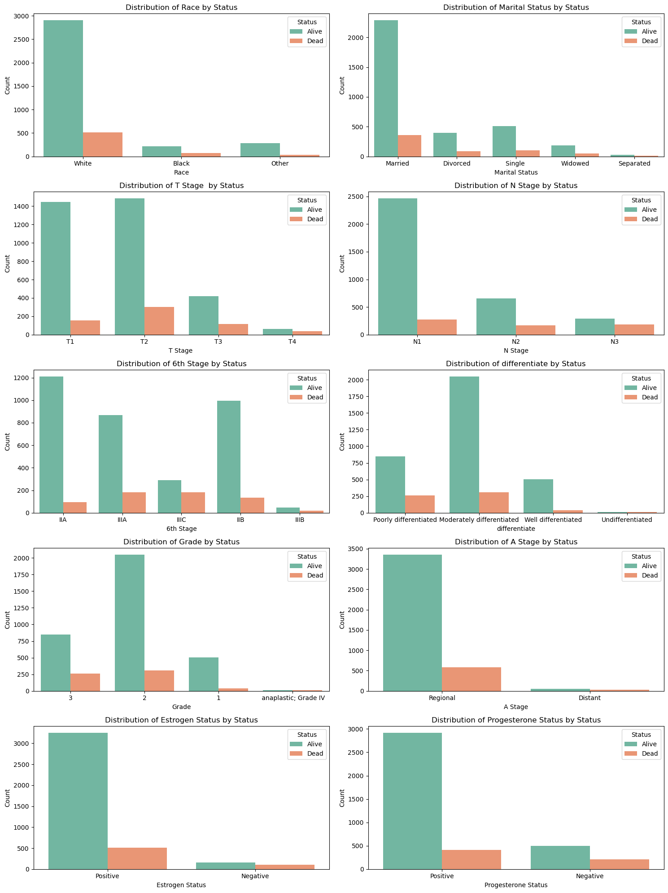

# Phase_3_Project
## Breast Cancer analysis
### Project Overview
This is project is intended to give an initial start in the entire data science process from start to finish solving a classification problem

#### Business Problem
Death among women has various factors and one of the leading causes being `Breast Cancer`. A good way of improving the survival rates and giving out personalized treatments depends on whether or not it can be detected early or predicted in advance. The intricacy and diversity of patient data, including age, tumor size, hormone receptor status, and staging, can make it difficult for medical professionals to assess the severity and course of the illness.
 
 A hospital that deals with breast cancer patients want a solution that can be used to classify patients based on their breast cancer characteristics and tell if they are likely to experience a more aggressive cancer. then secondly they would like to be able to predict a patients survival time based oon various factors both medical and demographic. The company can increase the precision of diagnosis and treatment strategies by using machine learning to predict survival months and classify the cancer status (e.g., aggressive vs. non-aggressive). The ultimate goal is to increase survival rates, reduce patient suffering, and optimize the overall cost-effectiveness of breast cancer care.

 #### Objectives

1. Create a predictive model to estimate survival time based on medical and demographic factors.
2. Develop a machine learning model to classify patients into categories such as aggressive vs. non-aggressive cancer.

### Data Understanding and Anaysis
#### Data source
The data we are using is sourced from Kaggle and can be found [here](https://www.kaggle.com/datasets/reihanenamdari/breast-cancer/data).The dataset of breast cancer patients was obtained from the 2017 November update of the SEER Program of the NCI, which provides information on population-based cancer statistics. The dataset involved female patients with infiltrating duct and lobular carcinoma breast cancer (SEER primary cites recode NOS histology codes 8522/3) diagnosed in 2006-2010. Patients with unknown tumour size, examined regional LNs, positive regional LNs, and patients whose survival months were less than 1 month were excluded; thus, 4024 patients were ultimately included.
the following are the columns that are found within the data:
1. Age                       
2. Race                      
3. Marital Status            
4. T Stage                   
5. N Stage                   
6. 6th Stage                 
7. differentiate             
8. Grade                     
9. A Stage                   
10. Tumor Size                
11. Estrogen Status           
12. Progesterone Status       
13. Regional Node Examined    
14. Reginol Node Positive     
15. Survival Months           
16. Status   

#### Analysis
First and foremost the columns from the dataset were allgrouped into them either being categorical or numerical. The reason for this is so that we will be able to decide which variables to use to create a linear regression and the ones that will be used for classification

##### Prediction
##### Linear Regression Analysis
The main aim of the linear regression was to try and see whether the data within the columns to be used  could predict survival months and the factors that could increase the survival months.
The columns used include:
1. Age
2. Tumor Size
3. Regional Node Examined
4. Reginol Node Positive
5. Survival Months

These column all have numerical values that will be used for creating a linear regression to calculate the number of survival months and which factors affect the survival months.

Here is a brief image of what the pair plot of these variables are:

###### Results of the linear regression
Model Fit: The R-squared and adjusted R-squared values are low, indicating that the model does not explain much of the variability in Survival Months.

Significance: While the model overall is statistically significant (based on the F-statistic), not all variables are contributing meaningfully (e.g., x1 is not significant).

Coefficients: Some variables (x2, x3, x4) have significant coefficients, suggesting they do impact survival months, but the effect sizes vary.

Assumptions: The normality tests suggest that the residuals may not be normally distributed, which could affect the validity of the model's inferences.

Given these results, the model might require refinement, such as exploring non-linear relationships, interaction effects, or considering other variables that might better explain the variation in survival months.

##### Classification
For classification the remaining columns were used. These include:
1. Race
2. Marital Status
3. T Stage
4. N Stage
5. 6th Stage
6. differentiate
7. Grade
8. A Stage
9. Estrogen Status
10. Progesterone Status
11. Status

The main focus of the classification would be to classify the patients based on whether there status. Below is a representation of how they each individually relate to the status

There are two models that have been used for classification
1. Logistic Regression
2. Decision Tree

##### Logistic Regression
##### Decision Tree
For the decision tree there were approximately three versions of the model that were used:
1. Vanilla Model
2. SMOTE applied Model
3. `max_depth` hyperparameter tuned
###### 1. Vanilla Model Results
1. Precision, Recall and F1_score 
    class 0 (Majority Class):

    Training Set: Precision = 0.88, Recall = 0.99, F1-Score = 0.94
    Test Set: Precision = 0.87, Recall = 0.97, F1-Score = 0.91
    The model performs very well for class 0, with high precision, recall, and F1-score in both the training and test sets. This suggests that the model is highly confident and accurate when predicting the majority class (class 0).

    Class 1 (Minority Class):

    Training Set: Precision = 0.89, Recall = 0.26, F1-Score = 0.40
    Test Set: Precision = 0.53, Recall = 0.21, F1-Score = 0.30

    The performance for class 1 is notably weaker, particularly in terms of recall and F1-score. This indicates that the model is struggling to correctly identify instances of the minority class (class 1), leading to many false negatives. The low recall means that many positive instances (class 1) are being missed.

2. Imbalance in Performance

    The disparity between the performance on class 0 and class 1 suggests that the model is biased towards predicting the majority class. This is common in imbalanced datasets where one class significantly outnumbers the other. The model's high accuracy is driven by its performance on class 0, but its ability to detect class 1 is poor.

3. Conclusion

    While the model performs well overall, its ability to detect the minority class (class 1) is lacking.There is aneed to address the class imbalance in the data.

###### SMOTE applied model results:
SMOTE has balanced the classes in the training data, leading to a more balanced precision and recall for both classes in the training set.
For the test set, the recall for class 1 (the minority class) improved from 0.21 to 0.49, indicating the model's improved ability to identify positive cases. However, the precision for class 1 decreased from 0.53 to 0.27, showing that the model is now making more false positive errors.
In the same light there has been a decrease in accuracy for both the train and test data.

###### max_depth hypaparameter tuning on the SMOTE model results
This model still fails at detecting the minority class in both the train and test data. This is because that they=re is clear evidence that there is not much increase in test performance no matter the amount of samples used.
This model has made it clear that whether another hyperparameter tuning model is used e.g. minimum sample there is a high likelihood that the results will still be the same

### Comparison of the two Classification Models used

#### Comparative Analysis

1. **Overall Accuracy**: Logistic regression has higher accuracy on both the training and test sets compared to the tuned decision tree.
2. **Class 0 Performance**: Both models perform well on Class 0, but logistic regression maintains consistency across both sets.
3. **Class 1 Performance**:
   - The tuned decision tree shows some improvement in recall and precision for Class 1 compared to the original logistic regression, but the metrics are still relatively low. 
   - Logistic regression's performance on Class 1 is quite poor, but the decision tree performs better in recall, suggesting it may better identify some of the minority class samples.

#### Suitability

- **Logistic Regression**: 
  - **Pros**: Consistently high performance on Class 0, high overall accuracy.
  - **Cons**: Struggles with Class 1, leading to a potential under representation of the minority class.
  
- **Decision Tree with SMOTE**:
  - **Pros**: Improved handling of the minority class (Class 1) due to SMOTE.
  - **Cons**: Lower overall accuracy and training accuracy, potentially overfitting or too simplistic due to max_depth of 1.

### Insights and Recomendations
Depending on the needs of the hospital there are two main options for the better classification model:
1. If the main focus of the hospital is the overall accuracy with respect to the majority class then the best model to use would be the Logistic Regression as it gives consistency among the train and test  

2. On the otherhand if the need is to improve the performance on the minority class, then with further tuning the Decision tree model might offer better results

Therefore the following are recommended:
1. Try othe models like Random Forest and Gradient Boosting among others which can potentially offer  a better balance between the precision and recall for both classes
2. To explore further adjustments or other models, the choice depends on the specific application and which metric (precision, recall, F1-score) is more important for the hospital